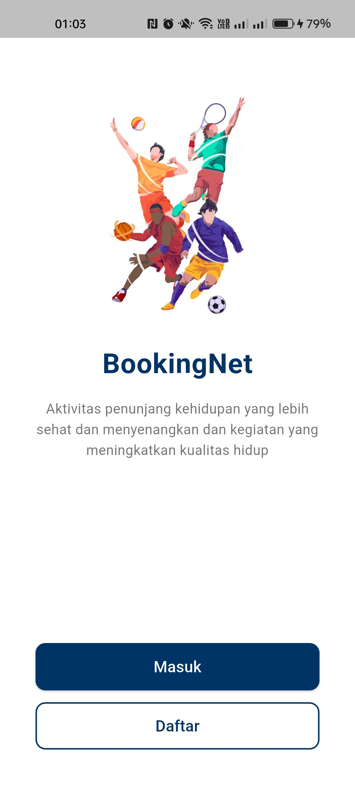
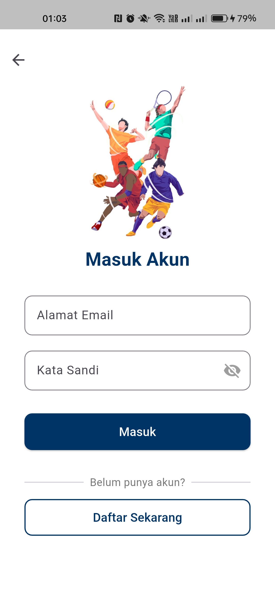
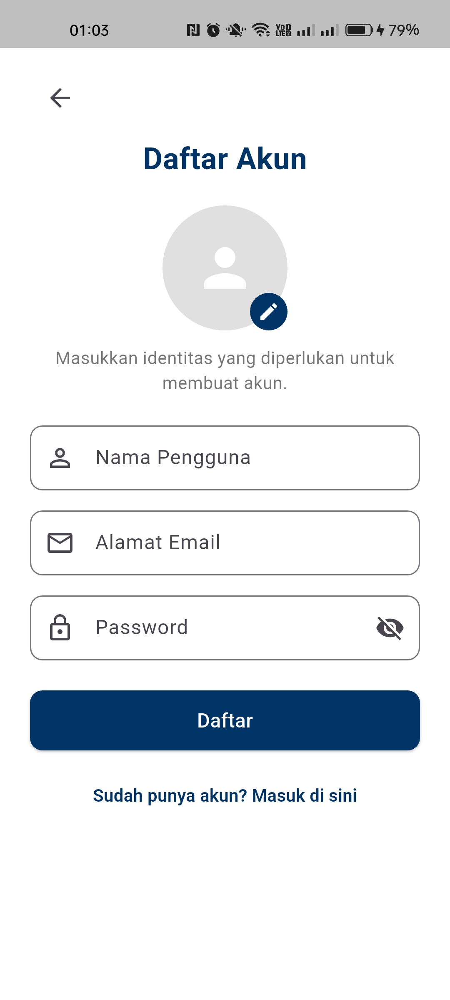
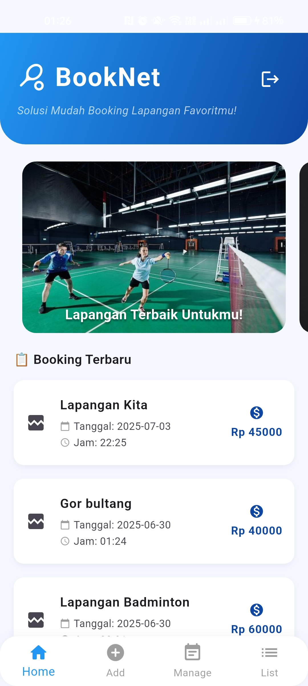
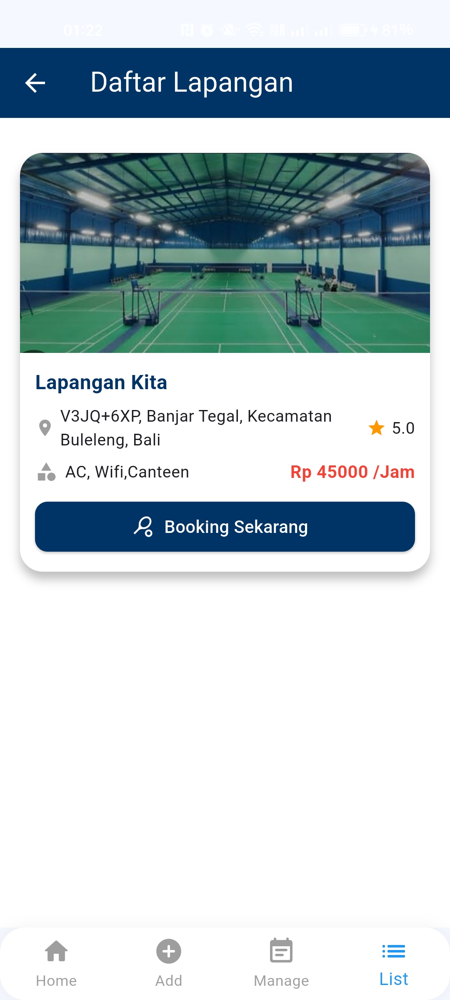
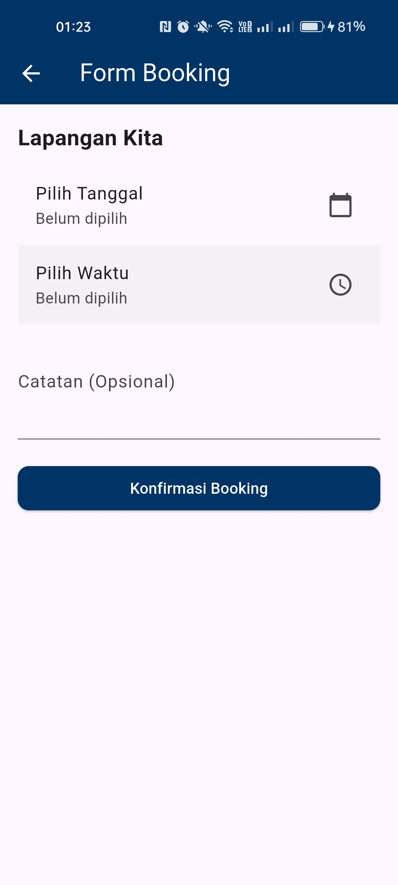
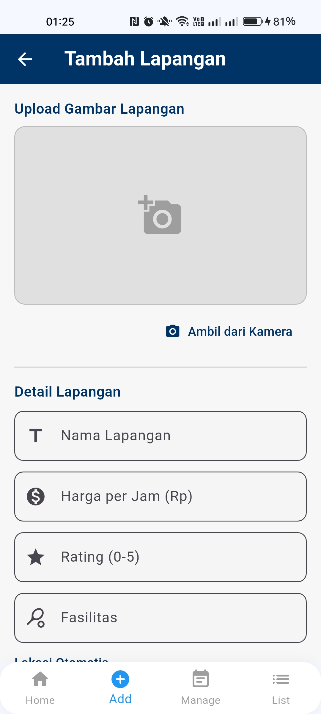
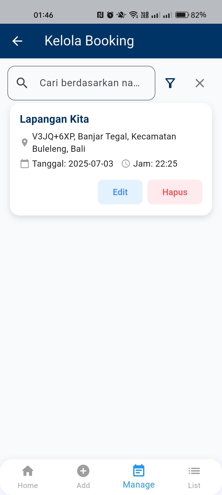
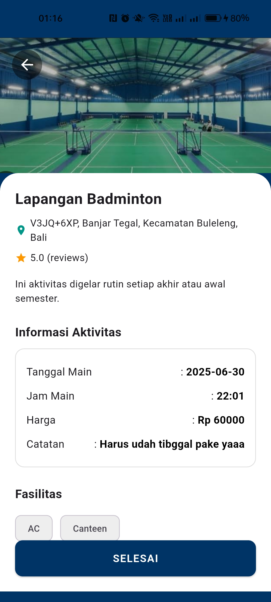

Aplikasi BookNet🏸🎾
Link file Apk :
[Donwload APK](https://github.com/mirelsimanjorang/Booking_Net_Mirel/blob/main/release/app-release.apk) (klik view raw)

## 📸 App Screenshots

<table>
  <tr>
    <td align="center"><strong>Welcome Screen</strong></td>
    <td align="center"><strong>Login</strong></td>
    <td align="center"><strong>Register</strong></td>
    
  </tr>
  <tr>
    <td></td>
    <td></td>
    <td></td>
  </tr>
  <tr>
    <td align="center"><strong>Home</strong></td>
    <td align="center"><strong>DaftarLapangan</strong></td>
    <td align="center"><strong>Booking</strong></td>
  </tr>
  <tr>
    <td></td>
    <td></td>
    <td></td>
  </tr>
  <tr>
     <td align="center"><strong>AddLapangan</strong></td>
    <td align="center"><strong>Kelola Booking</strong></td>
    <td align="center"><strong>Edit</strong></td>
  </tr>
  <tr>
    <td></td>
    <td></td>
    <td></td>
  </tr>
  <tr>
    <td align="center"><strong>Detail</strong></td>
  </tr>
  <tr>
    <td></td>
  </tr>
</table>
