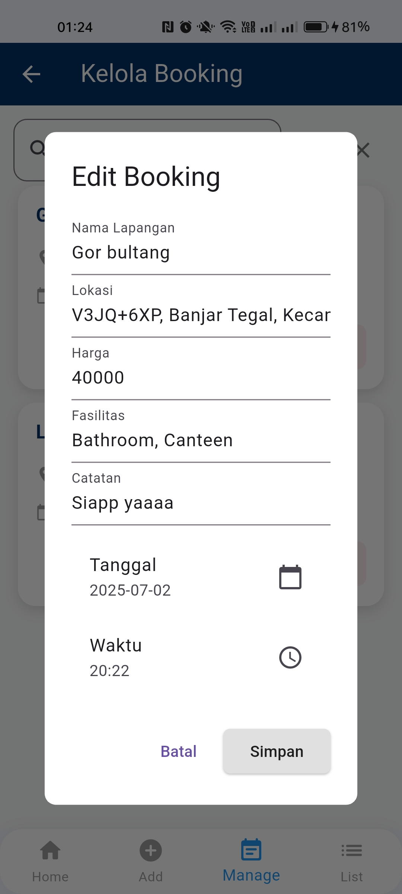

# Aplikasi BookNet 🏸🎾

Link file APK:  
👉 [Download APK](https://github.com/mirelsimanjorang/Booking_Net_Mirel/blob/main/release/app-release.apk)  
*(Klik "View raw" untuk mulai mengunduh)*

---

## Getting Started

This project is a starting point for a Flutter application.

A few resources to get you started if this is your first Flutter project:

- [Lab: Write your first Flutter app](https://docs.flutter.dev/get-started/codelab)
- [Cookbook: Useful Flutter samples](https://docs.flutter.dev/cookbook)

For help getting started with Flutter development, view the  
[online documentation](https://docs.flutter.dev/), which offers tutorials,  
samples, guidance on mobile development, and a full API reference.

---

## 📸 App Screenshots

<table>
  <tr>
    <td align="center"><strong>Welcome Screen</strong></td>
    <td align="center"><strong>Login</strong></td>
    <td align="center"><strong>Register</strong></td>
  </tr>
  <tr>
    <td></td>
    <td></td>
    <td></td>
  </tr>
  <tr>
    <td align="center"><strong>Home</strong></td>
    <td align="center"><strong>Daftar Lapangan</strong></td>
    <td align="center"><strong>Booking</strong></td>
  </tr>
  <tr>
    <td></td>
    <td></td>
    <td></td>
  </tr>
  <tr>
    <td align="center"><strong>Add Lapangan</strong></td>
    <td align="center"><strong>Kelola Booking</strong></td>
    <td align="center"><strong>Edit Booking</strong></td>
  </tr>
  <tr>
    <td></td>
    <td></td>
    <td></td>
  </tr>
  <tr>
    <td align="center"><strong>Detail Booking</strong></td>
  </tr>
  <tr>
    <td></td>
  </tr>
</table>
